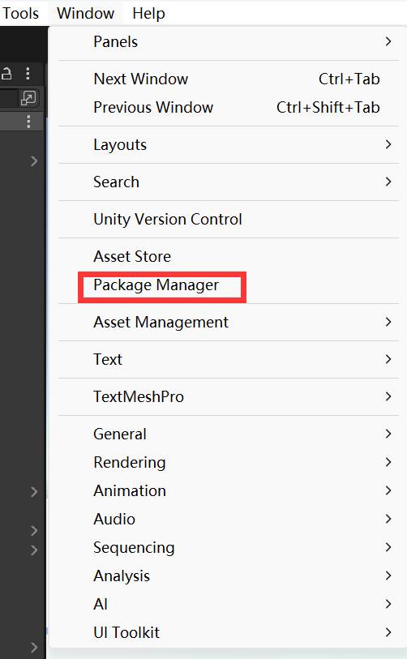
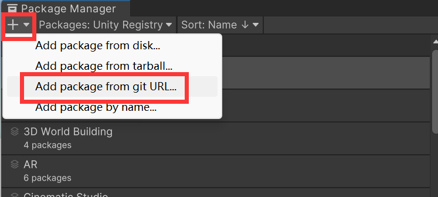
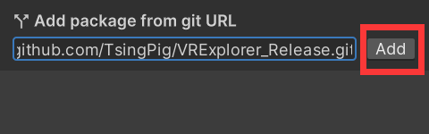
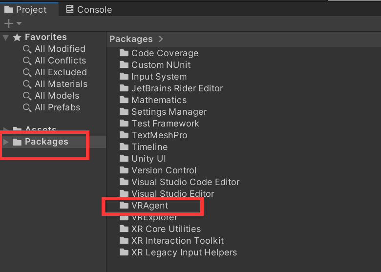
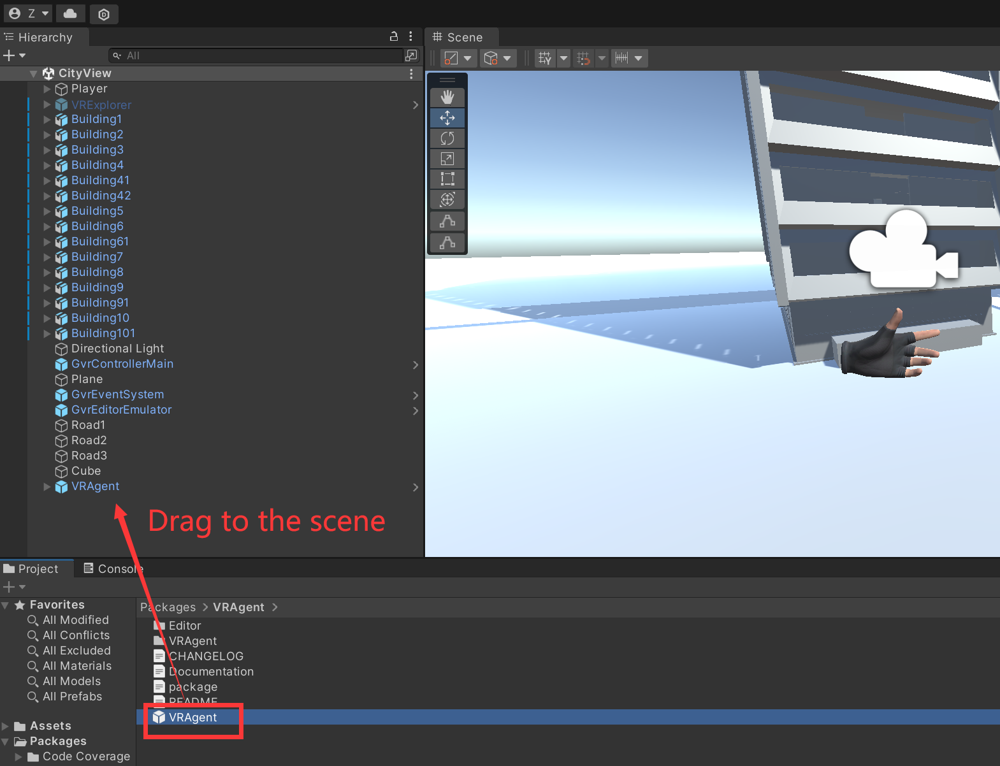
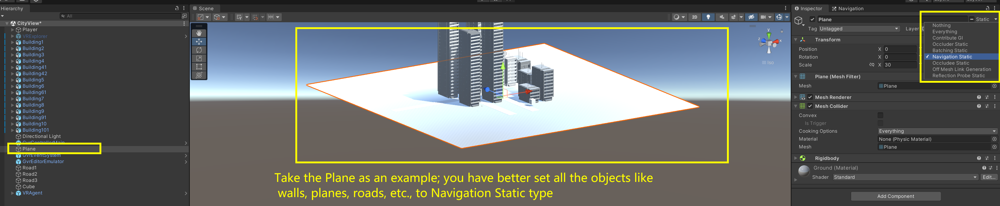
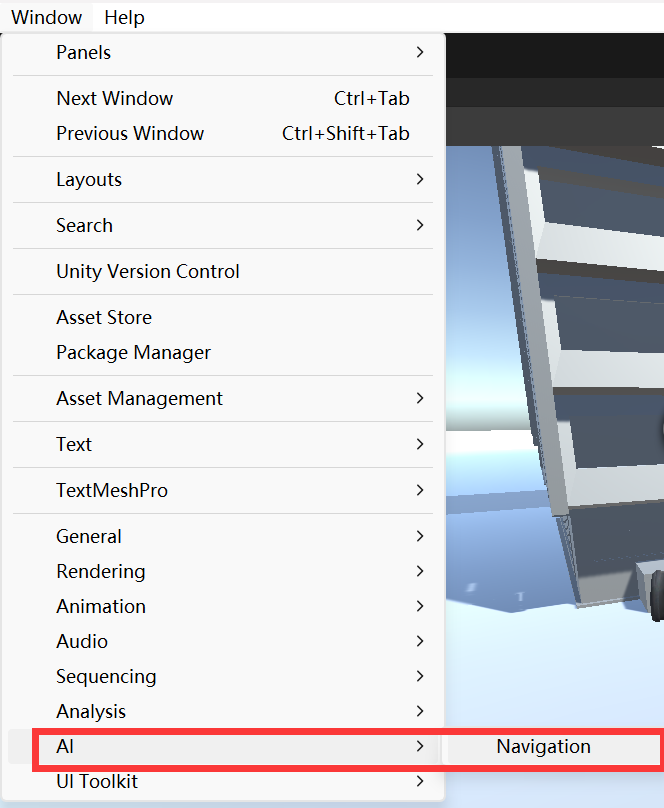
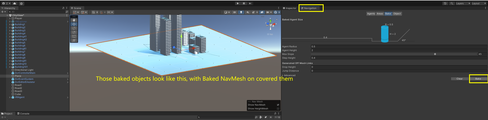

# VRAgent Guideline

This repository demonstrates how to integrate **Large Language Models (LLMs)** with **VRExplorer** to reduce manual effort in **model abstraction** and **dataset analysis** for automated VR application testing. The workflow supports LLM-generated (or manually authored) test plans that can be imported, validated, and executed inside Unity.

## Features

- LLM-assisted test plan generation (with optional RAG support)
- Seamless integration with VRExplorer’s testing pipeline
- Automated ID binding and runtime execution via VRAgent
- Reproducible and configurable VR test execution in Unity

## Setup

### 1. Unity Configuration

- Use the **recommended Unity version** **(2021.3.45f1c2)** 

- Add Required Packages via Unity Package Manager. This project depends on the following Unity packages.
     Add them **via Git URL** in **Unity Package Manager**:

    1. Open **Unity Editor**
    2. Go to **Window → Package Manager**         
    3. Click **`+` → Add package from git URL…**
    4. Add the following packages:

    - **VRExplorer**

        ```
        https://github.com/TsingPig/VRExplorer_Release.git
        ```

        

    - **VRAgent**

        ```
        https://github.com/TsingPig/VRAgent_Release.git
        ```

    After installation, ensure both packages are successfully loaded without errors.

### 2. Scene Preparation

1. Open or select the **scene to be tested** in Unity.

2. From the **Package** view, navigate to:

    ```
    Packages → VRAgent
    ```

3. Drag the **VRAgent Prefab** into the selected scene.

------

### 3. Navigation Mesh Baking

1. Select all static environment objects (e.g., walls, floors, obstacles).

2. Mark them as **Static** in the Inspector.
    

3. Open the Navigation window:

    ```
    Window → AI → Navigation
    ```

    

4. Bake the **NavMesh** for the scene.
    

------

## Usage

### 1. *[Optional]* Test Plan Generation

Test plans can be prepared using:

- **LLM-based generation** (optionally enhanced with Retrieval-Augmented Generation), or
- **Manual configuration**, following the predefined test plan format.

The generated test plan is expected to be in a structured (e.g., JSON-based) format compatible with VRExplorer.

------

### 2. Import Test Plan

In the Unity Editor, import the test plan via: 

```
Tools → VRExplorer → Import Test Plan → Browse → Import Test Plan
```


------

### 3. Test Plan Validation

Before execution, verify that:

- A **FileIdManager** has been generated in the testing scene.
- All fileID mappings are correct and complete.
    

### *[Optional]* Code Coverage Recorading

#### 1. Install Unity Code Coverage Package

1. Open **Unity Editor**
2. Go to **Window → Package Manager**
3. Enable **Unity Registry**
4. Search for **Code Coverage**
5. Install the **Code Coverage** package provided by Unity

------

#### 2. Select Scripts for Coverage Collection

1. Open the Code Coverage window:

    ```
    Window → Analysis → Code Coverage
    ```

2. In the Code Coverage settings:

    - Select the **assemblies or scripts** to be included in coverage recording
    - Exclude unrelated or third-party code if necessary

# Test Plan Format Guideline

## Top-Level Structure

- A **Test Plan** corresponds to a `TaskList` class object, i.e., a **“task list.”**
- A **task list** contains one or more `taskUnit`, i.e., **“taskUnits.”**
- A **taskUnit** contains one or more `actionUnit`, i.e., **“actionUnits.”** This is the smallest unit of action execution, such as grabbing or triggering.
- **Note:**
    - In the JSON format, additional fields beyond the specification are allowed, but required fields must not be omitted.

**JSON format structure**

```json
{
  "taskUnits": [
      { 	  // Task1
      "actionUnits": [
        {
         	// Task1-Action1
        },
        {
			// Task1-Action2
        }
      ]
    },
    {		// Task2
      "actionUnits": [
        {
			// Task2-Action1
        }
      ]
    }    
  ]
}

```

***

## Event System

In some interactions, it may be necessary to trigger or invoke **public** functions bound to object scripts. The corresponding action unit for such interactions must include one or more **event lists**.
 An event list in Unity corresponds to `List<UnityEvent>`. Each **event unit** corresponds to a single `UnityEvent`, which is a serializable and inspector-visible wrapper of a delegate, used to invoke bound functions in sequence. Each event unit contains multiple **callback function units**, each corresponding to a single UnityEvent listener, i.e., the actual function being invoked.

Summary:

- Each **event list** contains one or more `eventUnit` (i.e., **“events”**), corresponding to `UnityEvent`.
- Each **event unit** contains one or more callback function units (i.e., **“methodCallUnit”**), which are the smallest units that execute concrete functions, corresponding to a single UnityEvent listener.
- Multiple event units in an event list execute sequentially at a macro level; within the same event unit, multiple callback function units execute sequentially within the same frame but are **concurrent at the macro level**.

``` json
"events": [                 // List
    // Zero or more event units
    {
      "methodCallUnits": [  // One eventUnit, containing zero or more methodCallUnits
        {
          "script_fileID": <long>,       // FileID of the target script
          "method_name": "<string>",     // Name of the method to invoke
          "parameter_fileID": []         // List of FileIDs for method parameters
        }
      ]
    }
]

```

**Description of `methodCallUnit` fields**

| Field Name                       | Type   | Requirement                                    | Description                                                  |
| -------------------------------- | ------ | ---------------------------------------------- | ------------------------------------------------------------ |
| methodCallUnits.script_fileID    | long   | Required                                       | FileID of the target script                                  |
| methodCallUnits.method_name      | string | Required                                       | Name of the method to invoke (**function identifier only;** must not include return type, parameters, or qualifiers). |
| methodCallUnits.parameter_fileID | array  | Required in future (**But must be empty now**) | List of FileIDs for method parameters; parameters not supported in current version |

**Example:**

```json
"events": [
  {
    "methodCallUnits": [
      {
        "script_fileID": 124958031,     
        "method_name": "OpenTheDoor",     // A wrong format is "OpenTheDoor()" or "OpenTheDoor(...)"
        "parameter_fileID": []         // must be empty right now
      }
    ]
  }
]
```

***

## Interaction Definition

### Grab

#### Action Definition

The **Grab** action is divided into two types:

- **Grab1: Object-to-Object** (Grab Object to Object)
- **Grab2: Object-to-Position** (Grab Object to Position)

In JSON, these two types share some common fields. For example, `type` and `source_object_fileID` are always required, while `source_object_name` is optional.
 The difference lies in the target fields:

- **Object-to-Object (Grab1)** requires specifying the target object's name and FileID.
- **Object-to-Position (Grab2)** requires specifying the spatial coordinates in `target_position`.

By presenting all fields in a unified table with their requirements, users can clearly understand which fields are mandatory or optional under different Grab types, ensuring the correct construction of task or action JSON data.

| Field Name           | Type   | Requirement       | Description                                                  |
| -------------------- | ------ | ----------------- | ------------------------------------------------------------ |
| type                 | string | **Required**      | Always fixed as `"Grab"`                                     |
| source_object_name   | string | Optional          | Name of the source object initiating the grab (optional)     |
| source_object_fileID | long   | **Required**      | Unity FileID of the source object initiating the grab        |
| target_object_name   | string | Required in Grab1 | Name of the target object, used only in Object-to-Object (Grab1) |
| target_object_fileID | long   | Required in Grab1 | Unity FileID of the target object, used only in Object-to-Object (Grab1) |
| target_position      | object | Required in Grab2 | Target **World Position**, used only in Object-to-Position (Grab2); contains x, y, z |
| target_position.x    | float  | Required in Grab2 | Target X coordinate, used only in Object-to-Position (Grab2) |
| target_position.y    | float  | Required in Grab2 | Target Y coordinate, used only in Object-to-Position (Grab2) |
| target_position.z    | float  | Required in Grab2 | Target Z coordinate, used only in Object-to-Position (Grab2) |

#### Requirement for Action Objects

The **source object** must contain a **`Rigidbody` component** in Unity. Without it, the action cannot be executed correctly. (For Grab1 type, target object does not need to meet this condition)

#### Grab1 — Grab Object to Object

```json
{
  "type": "Grab",
  "source_object_name": "<string>",       // Name of the agent or object initiating the grab
  "source_object_fileID": <long>,         // FileID of the source object in the Unity scene file
  "target_object_name": "<string>",       // Name of the target object being grabbed
  "target_object_fileID": <long>          // FileID of the target object in the Unity scene file
}
```

#### Grab2 — Grab Object to Position

```json
{
  "type": "Grab",
  "source_object_name": "<string>",       // Name of the source object
  "source_object_fileID": <long>,         // FileID of the source object in the Unity scene file
  "target_position": {                    // Target world position to which the object should be moved
    "x": <float>,
    "y": <float>,
    "z": <float>
  }
}
```

#### Examples

**Grab1_Example1**

```json
{
  "type": "Grab",
  "source_object_name": "Pyramid_salle2",
  "source_object_fileID": 863577851,
  "target_object_name": "collider_porte",
  "target_object_fileID": 870703383
}
```

------

**Grab1_Example2**

The following example defines **one task** that contains **two Grab actions**.
 Alternatively, it can also be written in another form: **two tasks**, each containing **one Grab action**.

```json
{
  "taskUnits": [
    {
      "actionUnits": [
        {
          "type": "Grab",
          "source_object_fileID": 2076594680,  
          "target_object_fileID": 64330974
        },
        {
          "type": "Grab",
          "source_object_fileID": 1875767441,
          "target_object_fileID": 64330974
        }
      ]
    }
  ]
}
```

Another format (functionally equivalent, but with a different JSON organization for better readability).
 The latter form is **recommended**.

```json
{
  "taskUnits": [
    {
      "actionUnits": [
        {
          "type": "Grab",
          "source_object_fileID": 2076594680,  
          "target_object_fileID": 64330974
        }
      ]
    },
    {
      "actionUnits": [
        {
          "type": "Grab",
          "source_object_fileID": 1875767441,
          "target_object_fileID": 64330974
        }
      ]
    }
  ]
}
```

**Grab2_Example1:**

```json
{
  "type": "Grab",
  "source_object_name": "Cube_salle2",
  "source_object_fileID": 194480315,
  "target_position": {
    "x": 1.25,
    "y": 0.50,
    "z": -3.40
  }
}
```

***

###  Trigger

#### Action Definition

A **Trigger** describes the **triggering process of an interactive action**, mainly used to simulate how a player interacts with objects in a VR scene — for example, pressing a button, pulling a lever, or causing a state change.

The Trigger action is based on the framework’s **event system** and supports two types of events:

- **Triggering events (`triggerring_events`)**: events executed during the trigger process
- **Triggered events (`triggerred_events`)**: events executed after the trigger is completed

Both types of events can invoke public functions from Unity scripts, enabling the composition of more complex function logic.

```json
{
  "type": "Trigger",
  "source_object_name": "<string>",       // Name of the source object triggering the event
  "triggerring_time": <float>,            // Duration of the triggering process (seconds)
  "source_object_fileID": <long>,         // FileID of the source object in the Unity scene
  "condition": "<string>",                // Condition for triggering (may include script ID, GUID, serialized config, or expected behavior)
  "triggerring_events": [                 // List of events during the trigger process
    // Zero or more event units
    {
      "methodCallUnits": [                // One event unit, containing zero or more methodCallUnits
        {
          "script_fileID": <long>,        // FileID of the target script
          "method_name": "<string>",      // Name of the method to invoke (identifier only, no return type or parameters)
          "parameter_fileID": []          // List of FileIDs for method parameters
        }
      ]
    }
  ],
  "triggerred_events": [                  // List of events after the trigger completes
    // Zero or more event units
  ]
}
```

| Field Name           | Type   | Requirement  | Description                                                  |
| -------------------- | ------ | ------------ | ------------------------------------------------------------ |
| type                 | string | **Required** | Always fixed as `"Trigger"`                                  |
| source_object_name   | string | Optional     | Name of the source object                                    |
| source_object_fileID | long   | **Required** | FileID of the source object in the Unity scene               |
| condition            | string | Optional     | Description of the triggering condition                      |
| triggerring_time     | float  | **Required** | Duration of the triggering process (in seconds)              |
| triggerring_events   | array  | Optional     | Event list during the trigger process, serialized as UnityEvents |
| triggerred_events    | array  | Optional     | Event list after the trigger completes, serialized as UnityEvents |

#### Requirement for Action Objects

Only **public methods of classes that inherit from `MonoBehaviour`** can be invoked and added in `methodCallUnit`

#### Examples

**Example1**

The following example illustrates a **Trigger** task. In this task:

- `triggerring_events` contains two **eventUnits**, each of which contains one **methodCallUnit**.
- `triggerred_events` contains one **eventUnit**, which includes two **methodCallUnits** executed simultaneously.

**Events during the triggering process:** Reload → Fire

**Events after the trigger is completed:** Reload + Reload (simultaneously)

```json
{
  "taskUnits": [
    {
      "actionUnits": [
        {
          "type": "Trigger",
          "triggerring_time": 1.5,
          "source_object_fileID": 1448458900,
          "triggerring_events": [
            {
              "methodCallUnits": [
                {
                  "script_fileID": 1448458903,
                  "method_name": "Reload",
                  "parameter_fileID": []
                }
              ]
            },
            {
              "methodCallUnits": [
                {
                  "script_fileID": 1448458903,
                  "method_name": "Fire",
                  "parameter_fileID": []
                }
              ]
            }
          ],
          "triggerred_events": [
            {
              "methodCallUnits": [
                {
                  "script_fileID": 1448458903,
                  "method_name": "Reload",
                  "parameter_fileID": []
                },
                {
                  "script_fileID": 1448458903,
                  "method_name": "Reload",
                  "parameter_fileID": []
                }
              ]
            }
          ]
        }
      ]
    }
  ]
}
```

***

### Transform Definition

#### Action Definition

A **Transform** describes **translation, rotation, and scale operations** on an object, used to implement incremental adjustments (delta) of object states within an action unit.

- All fields represent **offsets**. For example, to scale an object along the Y-axis by 1.1×, set `delta_scale.y` to `0.1` rather than the absolute value.
- Transform actions inherit the **event system design** from Trigger, supporting **triggering events (`triggerring_events`)** and **triggered events (`triggerred_events`)**, which can invoke functions on the object’s Unity scripts during or after the transform.
- `triggerring_time` specifies the action duration, allowing smooth transitions.

Core purposes of Transform include:

1. **Dynamic object state adjustment** — e.g., translation, rotation, scaling to achieve animation or interactive feedback.
2. **Script behavior triggering** — calling methods bound in Unity scripts via event lists, supporting complex action and interaction logic.
3. **Incremental control** — the offset design allows action units to adjust relative to the current state, without needing absolute position, rotation, or scale.

```json
{
  "type": "Transform",
  "source_object_name": "<string>",        // Name of the target object
  "source_object_fileID": <long>,          // FileID of the target object in the Unity scene
  "delta_position": {                     // Position delta (offset)
    "x": <float>,
    "y": <float>,
    "z": <float>
  },
  "delta_rotation": {                     // Rotation delta (offset)
    "x": <float>,
    "y": <float>,
    "z": <float>
  },
  "delta_scale": {                        // Scale delta (offset)
    "x": <float>,
    "y": <float>,
    "z": <float>
  },
  "triggerring_events": [                  // List of events during the triggering process
    // Zero or more event units
    {
      "methodCallUnits": [                 // One event unit, containing zero or more methodCallUnits
        {
          "script_fileID": <long>,        // FileID of the target script
          "method_name": "<string>",       // Name of the method to invoke
          "parameter_fileID": []           // List of FileIDs for method parameters
        }
      ]
    }
  ],
  "triggerred_events": [                   // List of events after the trigger completes
    // Zero or more event units
  ],
  "triggerring_time": <float>              // Duration of the action (in seconds)
}

```

| Field Name           | Type   | Requirement / Notes                                          | Description                                                  |
| -------------------- | ------ | ------------------------------------------------------------ | ------------------------------------------------------------ |
| type                 | string | **Required**                                                 | Fixed as `"Transform"`                                       |
| source_object_name   | string | Optional                                                     | Name of the target object                                    |
| source_object_fileID | long   | **Required**                                                 | FileID of the target object in the Unity scene               |
| delta_position       | object | Required; use zero values if no movement (same for other delta fields) | Position offset, containing x, y, z float fields             |
| delta_rotation       | object | **Required**                                                 | Rotation offset, containing x, y, z float fields             |
| delta_scale          | object | **Required**                                                 | Scale offset, containing x, y, z float fields                |
| triggerring_events   | array  | Optional; list of events during the transform process, serialized as UnityEvent | Events executed during the transform process, serialized as UnityEvent list |
| triggerred_events    | array  | Optional                                                     | Events executed after the transform completes, serialized as UnityEvent list |
| triggerring_time     | float  | **Required**                                                 | Duration of the transform action (in seconds)                |

#### Requirement for Action Objects

The **source object** must contain a **`Collider` component** in Unity, that can respond to physics or interaction.

#### Examples

**Example1:** The following example scales the target object to **1.5× its original size within 3 seconds**, with a delta value of `0.5`:

```json
{
      "actionUnits": [
        {
          "type": "Transform",
          "source_object_fileID": 1760679936,
          "delta_position": {
            "x": 0,
            "y": 0,
            "z": 0
          },
          "delta_rotation": {
            "x": 0,
            "y": 0,
            "z": 0
          },
          "delta_scale": {
            "x": 0.5,
            "y": 0.5,
            "z": 0.5
          },
          "triggerring_time": 3
        }
      ]
    }
```


# Appendix

**C# 接口 代码**

> ```c#
> [Serializable] public class TaskList { [JsonProperty("taskUnits")] public List<TaskUnit> taskUnits; }
> [Serializable] public class TaskUnit { [JsonProperty("actionUnits")] public List<ActionUnit> actionUnits; }
> [Serializable] public class eventUnit { [JsonProperty("methodCallUnits")] public List<methodCallUnit> methodCallUnits; }
> 
> [Serializable]
> public class methodCallUnit
> {
> [JsonProperty("script_fileID")] public string script;
> [JsonProperty("method_name")] public string methodName;
> [JsonProperty("parameter_fileID")] public List<string>? parameters;
> }
> 
> [JsonConverter(typeof(ActionUnitConverter))] // 支持JSON多态
> public class ActionUnit
> {
> public string type; 
> [JsonProperty("source_object_fileID")] public string objectA;
> }
> 
> public class GrabActionUnit : ActionUnit
> {
> [JsonProperty("target_object_fileID")] public string? objectB;
> [JsonProperty("target_position")] public Vector3? targetPosition;
> }
> 
> public class TriggerActionUnit: ActionUnit
> {
> [JsonProperty("triggerring_events")] public List<eventUnit> triggerringEvents;
> [JsonProperty("triggerred_events")] public List<eventUnit> triggerredEvents;
> }
> 
> /// <summary>
> /// TransformActionUnit 用于描述物体的平移/旋转/缩放操作
> /// </summary>
> public class TransformActionUnit : TriggerActionUnit
> {
>  [JsonProperty("delta_position")] public Vector3 deltaPosition;
>  [JsonProperty("delta_rotation")] public Vector3 deltaRotation;
>  [JsonProperty("delta_scale")] public Vector3 deltaScale;
> }
> ```

