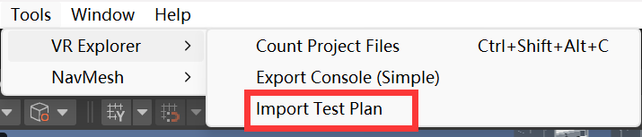
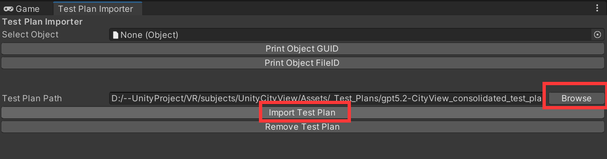

# README

This repository demonstrates how to integrate **Large Language Models (LLMs)** with **VRExplorer** to reduce manual effort in **model abstraction** and **dataset analysis** for automated VR application testing. The workflow supports LLM-generated (or manually authored) test plans that can be imported, validated, and executed inside Unity.

## Features

- LLM-assisted test plan generation (with optional RAG support)
- Seamless integration with VRExplorer’s testing pipeline
- Automated ID binding and runtime execution via VRAgent
- Reproducible and configurable VR test execution in Unity

## Setup

### 1. Unity Configuration

- Use the **recommended Unity version** **(2021.3.45f1c2)** 

- Add Required Packages via Unity Package Manager. This project depends on the following Unity packages.
     Add them **via Git URL** in **Unity Package Manager**:

    1. Open **Unity Editor**
    2. Go to **Window → Package Manager**         
    3. Click **`+` → Add package from git URL…**
    4. Add the following packages:

    - **VRExplorer**

        ```
        https://github.com/TsingPig/VRExplorer_Release.git
        ```

        

    - **VRAgent**

        ```
        https://github.com/TsingPig/VRAgent_Release.git
        ```

    After installation, ensure both packages are successfully loaded without errors.

### 2. Scene Preparation

1. Open or select the **scene to be tested** in Unity.

2. From the **Package** view, navigate to:

    ```
    Packages → VRAgent
    ```

3. Drag the **VRAgent Prefab** into the selected scene.

------

### 3. Navigation Mesh Baking

1. Select all static environment objects (e.g., walls, floors, obstacles).

2. Mark them as **Static** in the Inspector.
    

3. Open the Navigation window:

    ```
    Window → AI → Navigation
    ```

    

4. Bake the **NavMesh** for the scene.
    

------

## Usage

### 1. *[Optional]* Test Plan Generation

Test plans can be prepared using:

- **LLM-based generation** (optionally enhanced with Retrieval-Augmented Generation), or
- **Manual configuration**, following the predefined test plan format.

The generated test plan is expected to be in a structured (e.g., JSON-based) format compatible with VRExplorer.

------

### 2. Import Test Plan

In the Unity Editor, import the test plan via: 

```
Tools → VRExplorer → Import Test Plan → Browse → Import Test Plan
```






------

### 3. Test Plan Validation

Before execution, verify that:

- A **FileIdManager** has been generated in the testing scene.
- All fileID mappings are correct and complete.
    

### *[Optional]* Code Coverage Recorading

#### 1. Install Unity Code Coverage Package

1. Open **Unity Editor**
2. Go to **Window → Package Manager**
3. Enable **Unity Registry**
4. Search for **Code Coverage**
5. Install the **Code Coverage** package provided by Unity

------

#### 2. Select Scripts for Coverage Collection

1. Open the Code Coverage window:

    ```
    Window → Analysis → Code Coverage
    ```

2. In the Code Coverage settings:

    - Select the **assemblies or scripts** to be included in coverage recording
    - Exclude unrelated or third-party code if necessary
